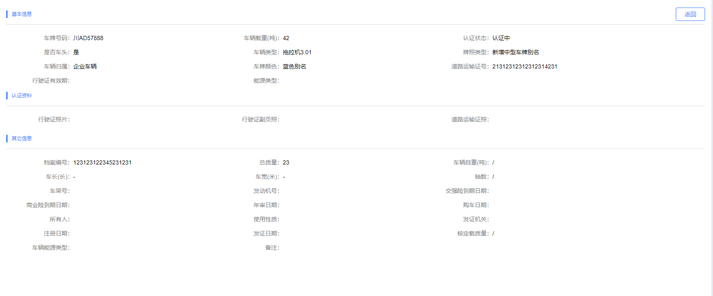

##### CardDetails 配置项详解

展示如下图


- 使用方式

```javascript

  <card-details :options="options"
                  @onButtonClick="onButtonClick"></card-details>

  import GridPage from "@/components/Page/GridPage.vue";
  import cardDetails from "@/components/Card/card-details.vue";

  // components 注册子组件cardDetails

  // 继承GridPage
  export default class 当前页面组件类 extends GridPage {

  }

```

- options 参数配置

| name         | type   | default | Description                     |
| ------------ | ------ | ------- | ------------------------------- |
| direction    | string |         | horizontal/vertical, //布局方式 |
| elementWidth | string |         | 每列宽度(30%/30px)              |
| labelWidth   | string |         | label 宽度(30%/30px)            |
| data         | object |         | 参数名对应 group prop 名        |
| group        | Array  |         | 对应每个字段                    |

```javascript
options = {
  direction: "horizontal" || "vertical",
  elementWidth: "30%",
  labelWidth: "140px",
  data: {},
  group: [
    {
      title: "基本信息",
      refuseError: {
        prop: "refuseInfo",
        label: "拒绝理由",
      },
      params: [
        {
          prop: "plateNumber",
          label: "车牌号码",
        },
      ],
    },
    {
      title: "认证资料",
      params: [
        {
          prop: "drivinglicenseURL",
          label: "行驶证照片",
          format: true,
        },
      ],
    },
    {
      title: "其它信息",
      params: [
        {
          prop: "carWeight",
          label: "车辆自重(吨)",
        },
      ],
    },
  ],
  buttonGroup: [
    {
      class: "hcd_button_back",
      text: "返回",
      methods: "back",
      btnShow: true,
    },
  ],
};
```
