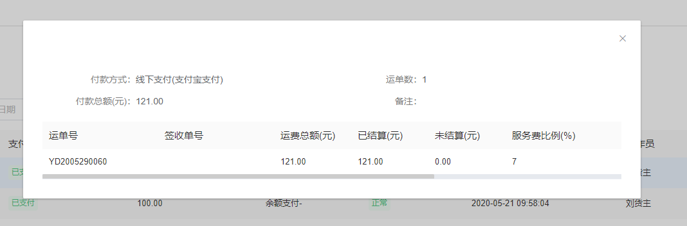

##### DialogGridPage （为 gridPage 和 cardDtails 的弹窗组合页面配置）

展示如下图



* 基本所有的时间方法都一样，可以按照其它页面组件配置来
```javascript
 import dialogGridPage from "@/components/Page/DialogGridPage.vue";

 // components 注册子组件 dialogGridPage
 // extends dialogGridPage

     <dialogGridPage :options="pageOptions"
                    @onFieldChange="onFieldChange"
                    @onButtonClick="onButtonClick"
                    @onPageClick="onPageClick"
                    @onClose="closeFun"
                    ref="dialogGridPage"></dialogGridPage>
```

```javascript
options: any = {
  details: true,
  detailsOptions: {
    direction: "horizontal" || "vertical",
    elementWidth: "50%",
    labelWidth: "140px",
    data: {},
    group: [
      {
        params: [
          {
            prop: "remark",
            label: "备注",
          },
        ],
      },
    ],
  },
  table: {
    tableData: [],
    isListPage: true,
    totalPage: false,
    tableLabel: [{ prop: "sysCode", title: "运单号", minWidth: "180" }],
  },
};
```
