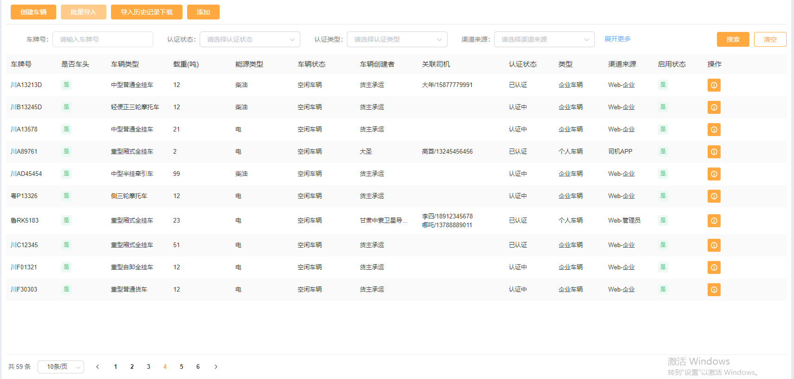

##### GridPage 配置项详解 所有配置可在子目录进行查看

展示如下图


参数：

| name                 | type     | default | Description                                                       |
| -------------------- | -------- | ------- | ----------------------------------------------------------------- |
| options          | object   | {}      | 配置项                                                            |
| onFieldChange        | function |         | 字段改变触发事件                                                  |
| onPageClick          | funciton |         | table页码触发事件                                              |
| onButtonClick        | funciton |         | 按钮触发事件                                                      |
| onSelectionClick     | funciton |         | 为表格配置了 selection 为 true，表格显示多选框 点击多选框触发事件 |
| onFieldVisibleChange | funciton |         | 针对 hcd-select,下拉项选中触发                                    |

使用方式

```javascript
 import GridPage from "@/components/Page/GridPage.vue";

 //注册为子组件 components

 <GridPage :options="options"
              @onFieldChange="onFieldChange"
              @onButtonClick="onButtonClick"
              @onPageClick="onPageClick"
              @onSelectionClick="onSelectionClick"
              @onFieldVisibleChange="onSelectionClick"
              ref="gridPage"></GridPage>
```
